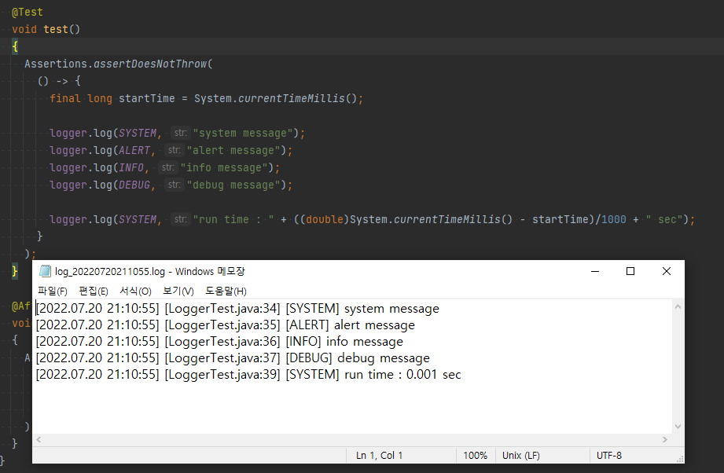

# Logger
- java7, (test java8) 
- Log4j 등 로그 라이브러리를 사용할 수 없는 폐쇄적 환경에서 로그를 사용하기 위한 프로젝트
- main(파일쓰기), console(콘솔출력) 두 방식을 기본 지원
- Windows 환경


## example
```java
public class LoggerMain
{
  private static Logger logger;

  static
  {
    try
    {
      Class.forName("com.roman14.log.LoggerPools");
    }
    catch ( ClassNotFoundException e )
    {
      e.printStackTrace();
    }

    logger = LoggerPools.getLogger(LoggerPools.MAIN_LOGGER_NAME);  // 파일에 로그 출력
    //logger = LoggerPools.getLogger("console");  // 콘솔에 로그 출력
  }

  public static void main(String[] args)
  {
    try
    {
      final long startTime = System.currentTimeMillis();

      logger.log(LoggerInfo.SYSTEM, "system message");
      logger.log(LoggerInfo.ALERT, "alert message");
      logger.log(LoggerInfo.INFO, "info message");
      logger.log(LoggerInfo.DEBUG, "debug message");

      logger.log(LoggerInfo.SYSTEM, "run time : " + ((double)System.currentTimeMillis() - startTime)/1000 + " sec");

      logger.close();
    }
    catch(Exception e)
    {
      e.printStackTrace();
    }
  }
}
```
## result
```
[2022.03.29 14:30:58] [LoggerMain.java:32] [SYSTEM] system message
[2022.03.29 14:30:58] [LoggerMain.java:33] [ALERT] alert message
[2022.03.29 14:30:58] [LoggerMain.java:34] [INFO] info message
[2022.03.29 14:30:58] [LoggerMain.java:35] [DEBUG] debug message
[2022.03.29 14:30:58] [LoggerMain.java:37] [SYSTEM] run time : 0.0 sec
```

